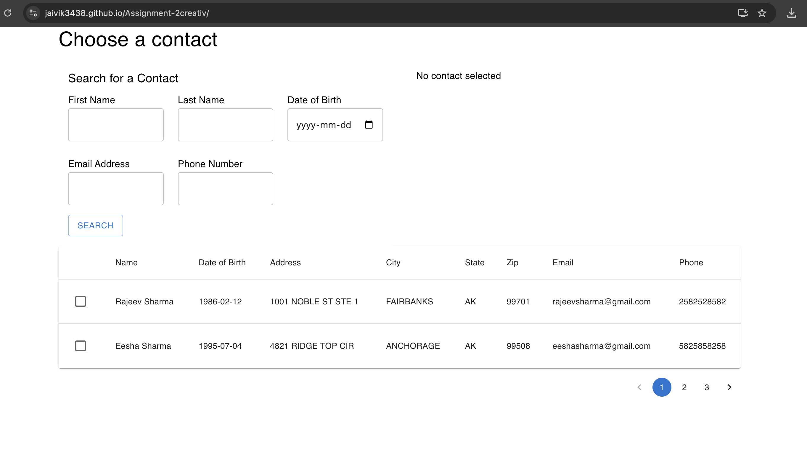
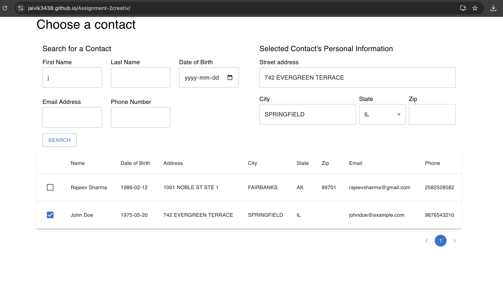

# 📇 Contact Search App

Welcome to the **Contact Search App**! This React-based application allows users to search for contacts from a given JSON data set. It features multiple search filters, displays results in a table format, and allows single contact selection with data updates. This project is built using **React** and **Material-UI** for a modern, user-friendly interface. To use this application click on this link. [Contact Search App](https://jaivik3438.github.io/Assignment-2creativ) 

---

## 🚀 Project Features

- **Search Filters**: Search for contacts by:
  - First Name
  - Last Name
  - Date of Birth
  - Email Address
  - Phone Number

- **Search Results Table**: Display search results with the following details:
  - Name
  - Date of Birth
  - Address
  - City
  - State
  - Zip Code
  - Email Address
  - Phone Number

- **Pagination**: Navigate through large datasets with ease.

- **Single Contact Selection**: Select a contact from the search results, and the app will automatically update the record with that contact's data on the right side of the page.

- **User-Friendly Interface**: A clear, responsive, and modern UI using Material-UI for seamless interaction.

---

## 📋 Prerequisites

Before running the app, ensure you have the following installed:

- [Node.js](https://nodejs.org/) (LTS version recommended)
- [npm](https://www.npmjs.com/) or [Yarn](https://yarnpkg.com/) (package manager)

---

## 🔧 Installation Guide

1. **Clone the Repository**:
   ```bash
   git clone https://github.com/Jaivik3438/Assignment-2creativ.git
   cd contact-search-app
   ```

2. **Install Dependencies**:
   ```bash
   npm install
   # OR
   yarn install
   ```

3. **Run the App Locally**:
   ```bash
   npm start
   # OR
   yarn start
   ```

   The app will be available at `http://localhost:3000`.

---

## 💡 Usage Guide

### How to Use the App

1. **Enter Search Criteria**:
   - Use the search bar to filter contacts by first name, last name, date of birth, email, or phone number.
   - Input one or more filters as needed.

2. **View Results**:
   - Search results will be displayed in a table with all relevant contact details.
   - Results are paginated to make browsing large datasets easier.

3. **Select a Contact**:
   - Click on a checkbox in the table to select individual.
   - The selected person's data will be displayed in a right side of the page as mentioned in requirements.

---
# Test Cases for Contact Search Feature

## Overview
This document outlines test cases for the Contact Search Feature built using React and Material UI. These test cases validate the functionality, UI behavior, and usability of the application.

---

## Test Case Template

| **Test Case ID** | **Test Scenario** | **Test Steps** | **Expected Results** | **Sample Data (if applicable)** |
|-------------------|--------------------|----------------|-----------------------|----------------------------------|

---

## Test Cases

### **Search Filters**

| **Test Case ID** | **Test Scenario**              | **Test Steps**                                                                                   | **Expected Results**                                                                                                                                                       | **Sample Data**                         |
|-------------------|--------------------------------|---------------------------------------------------------------------------------------------------|---------------------------------------------------------------------------------------------------------------------------------------------------------------------------|------------------------------------------|
| TC001             | Search by First Name          | 1. Enter `John` in the First Name field.<br>2. Click "Search".                                    | The table displays only rows where the `First Name` matches `John`.                                                                                                       | `{"firstName": "John"}`              |
| TC002             | Search by Last Name           | 1. Enter `Doe` in the Last Name field.<br>2. Click "Search".                                      | The table displays only rows where the `Last Name` matches `Doe`.                                                                                                         | `{"lastName": "Doe"}`                |
| TC003             | Search by Date of Birth       | 1. Enter `1990-01-01` in the Date of Birth field.<br>2. Click "Search".                          | The table displays only rows where the `DOB` matches `1990-01-01`.                                                                                                        | `{"dob": "1990-01-01"}`              |
| TC004             | Search by Email Address       | 1. Enter `john.doe@example.com` in the Email Address field.<br>2. Click "Search".                | The table displays only rows where the `Email` matches `john.doe@example.com`.                                                                                            | `{"email": "john.doe@example.com"}`  |
| TC005             | Search by Phone Number        | 1. Enter `1234567890` in the Phone Number field.<br>2. Click "Search".                           | The table displays only rows where the `Phone` matches `1234567890`.                                                                                                      | `{"phone": "1234567890"}`            |
| TC006             | Search by Multiple Criteria   | 1. Enter `Jane` in the First Name field.<br>2. Enter `1985-05-15` in the Date of Birth field.<br>3. Click "Search". | The table displays rows that match `First Name: Jane` **and** `DOB: 1985-05-15`.                                                                                          | `{"firstName": "Jane", "dob": "1985-05-15"}` |

---

### **Search Results**

| **Test Case ID** | **Test Scenario**                    | **Test Steps**                                                                                  | **Expected Results**                                                                                                                       | **Sample Data**                         |
|-------------------|--------------------------------------|--------------------------------------------------------------------------------------------------|---------------------------------------------------------------------------------------------------------------------------------------------|------------------------------------------|
| TC007             | Display results in a table format   | 1. Enter valid search criteria.<br>2. Click "Search".                                           | The table displays results matching the search criteria.                                                                                     | N/A                                      |
| TC008             | Validate displayed columns          | 1. Enter valid search criteria.<br>2. Click "Search".                                           | The table displays columns for `Name`, `Date of Birth`, `Address`, `City`, `State`, `Zip Code`, `Email`, and `Phone Number`.                           | N/A                                      |                                     |

---

### **Pagination**

| **Test Case ID** | **Test Scenario**                    | **Test Steps**                                                                                  | **Expected Results**                                                                                                                       | **Sample Data**                         |
|-------------------|--------------------------------------|--------------------------------------------------------------------------------------------------|---------------------------------------------------------------------------------------------------------------------------------------------|------------------------------------------|
| TC009             | Display 2 records per page          | 1. Ensure more than 2 records exist.<br>2. Perform a search.<br>3. Check the displayed results.  | Only 2 records are displayed on the first page.                                                                                             | N/A                                      |
| TC010             | Navigate to next page               | 1. Perform a search that results in more than 2 records.<br>2. Click the "Next Page" button.    | The table displays the next set of 2 records.                                                                                               | N/A                                      |

---

### **Single Contact Selection**

| **Test Case ID** | **Test Scenario**                          | **Test Steps**                                                                                  | **Expected Results**                                                                                                                       | **Sample Data**                         |
|-------------------|--------------------------------------------|--------------------------------------------------------------------------------------------------|---------------------------------------------------------------------------------------------------------------------------------------------|------------------------------------------|
| TC011             | Select a contact                          | 1. Search for a contact.<br>2. Click the checkbox for the desired contact.                      | The contact’s details (`Address`, `City`, `Zip`, `State`, etc.) are populated in the form below.                                           | N/A                                      |

---

### **UI/UX**

| **Test Case ID** | **Test Scenario**                     | **Test Steps**                                                                                  | **Expected Results**                                                                                                                       | **Sample Data**                         |
|-------------------|---------------------------------------|--------------------------------------------------------------------------------------------------|---------------------------------------------------------------------------------------------------------------------------------------------|------------------------------------------|
| TC012             | Verify responsive layout             | 1. Open the application in different screen sizes (desktop, tablet, mobile).                   | The application layout adjusts properly, with no overlapping or broken components.                                                          | N/A                                      |

---

## Execution Steps

1. Run the application locally or use [Contact Search App](https://jaivik3438.github.io/Assignment-2creativ).
2. Use the provided sample data to execute each test case.
3. Record results as **Pass/Fail** for documentation.

---


## 🖼️ Screenshots

Here are some screenshots to give you an overview of the app:

### Home Page



### Search Results



---

## 📦 Technologies Used

- **React**: The core library for building the user interface.
- **Material-UI**: Provides a modern design and responsive components.
- **JavaScript**: The programming language used to build the app.

---

## ⚙️ Live Application Link 
- **Live Application**: [Contact Search App](https://jaivik3438.github.io/Assignment-2creativ) 

---

## ⚙️ Deployment on GitHub Pages

To deploy the app on GitHub Pages, follow these steps:

1. **Install `gh-pages`**:
   ```bash
   npm install gh-pages --save-dev
   ```

2. **Add a `homepage` property in `package.json`**:
   ```json
   "homepage": "https://yourusername.github.io/contact-search-app"
   ```

3. **Add deployment scripts in `package.json`**:
   ```json
   "scripts": {
     "predeploy": "npm run build",
     "deploy": "gh-pages -d build"
   }
   ```

4. **Deploy the App**:
   ```bash
   npm run deploy
   ```

   Your app will be live at `https://yourusername.github.io/contact-search-app`.

---

## 🤝 Acknowledgements

- **React** and **Material-UI** for building modern web apps.
- Open-source community for providing excellent tools and libraries.

---

Thank you for using the **Contact Search App**! We hope it helps you manage and search your contacts efficiently. 🌟
